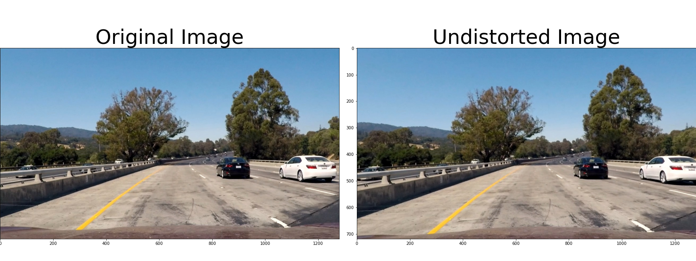
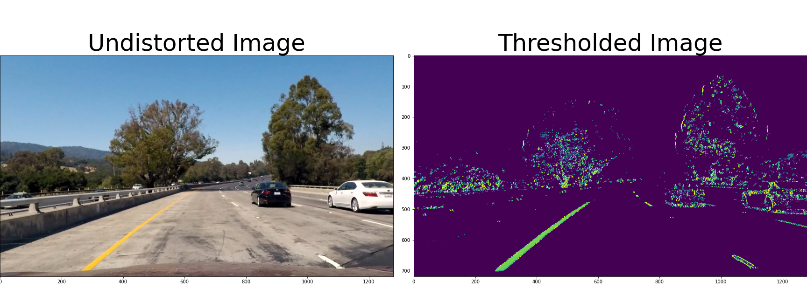
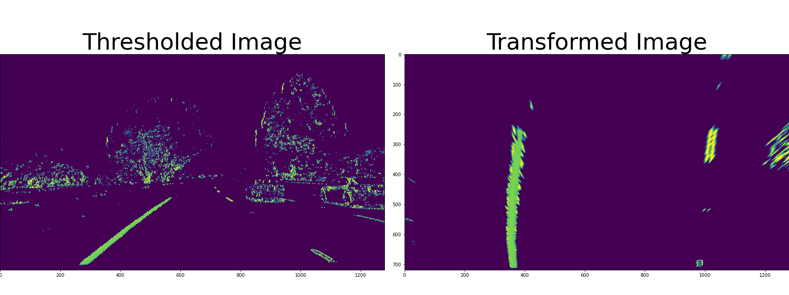
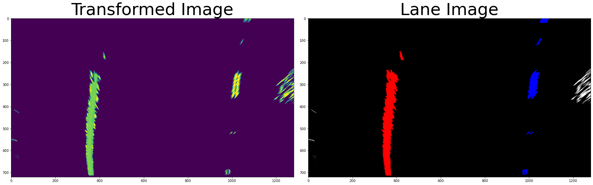
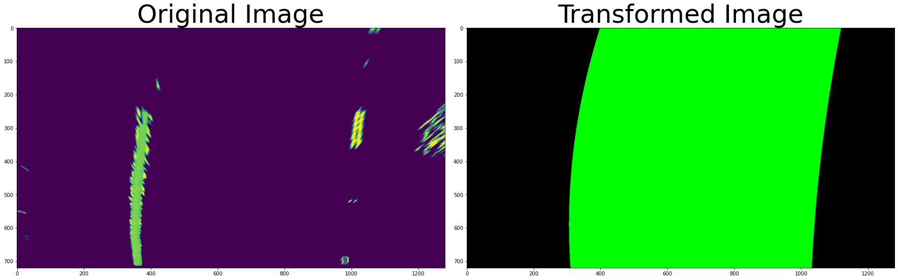
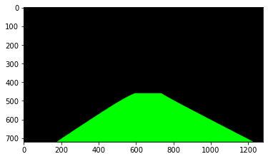
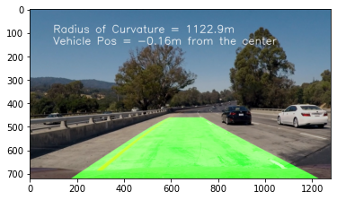

# **Finding Lane Lines on the Road** 

Project Goal
---

Implement an image pipeline that finds lane lines from road videos including:
* Takes road images from a video and return an annotated video stream
* Lane finding algorithm which:
  * finds the left and right lane lines and visualize the found lane
  * outputs visual display of the numerical estimation of lane curvature and vehicle position.

Reflection
---

### 1. Image Pipeline Description

The image pipeline is consists of the total of seven steps. I'll explain each step below.

1) Compute the camera calibration matrix and distortion coefficients given a set of chessboard images and apply a distortion correction to raw images.
2) Use color transforms, gradients, etc., to create a thresholded binary image.
3) Apply a perspective transform to rectify binary image ("birds-eye view").
4) Detect lane pixels and fit to find the lane boundary.
5) Determine the curvature of the lane and vehicle position with respect to center.
6) Warp the detected lane boundaries back onto the original image.
7) Output visual display of the lane boundaries and numerical estimation of lane curvature and vehicle position.

**1) Compute the camera calibration matrix and distortion coefficients given a set of chessboard images and apply a distortion correction to raw images**

First of all, it finds camera matrix from given chessboard images in `camera_cal` folder. The code for this step is in the first and second section in `01-distortion-correction.ipynb` file. Note that the size of the chessboard(`nx`,`ny`) must be considered before the computation. It find all chessboard corners with `cv2.findChessboardCorners()`. and finds calibration matrix and distortion coefficients with `cv2.calibrateCamera()` from found corners. Then, it applies undistortion to an image. It uses `cv2.undistort()` function for this step. I wraped this step with a function named `cal_undistort(img, mtx, dist)`, located at L26~28 of `image_functions.py`. An output example of this step is shown below.

*Fig 1. An example of undistorted road image*

**2) Use color transforms, gradients, etc., to create a thresholded binary image.**

After the undistortion step, it needs to seperate the lane from other objects in the image. The code for this step is in `02-color-gradient-thresholding.ipynb` and `thresholding.py`. First, I extracted test images from the input videos. Then, I aggregated the test images into a single image. Next, I created a simple OpenCV GUI app which can apply color and gradient thresholding into the test image to find out the best parameter to seperate lane lanes.
After this step, I wraped the thresholding process with a function named `threshold_combined()` which located at L34-56 of `image_functions.py`. The function seperates white and yellow color by generating masked images from image using rgb, hsv, hls image mask. In this step, it creates the three masked images. Then, it uses s channel for compute gradient and threshold the gradient image. The final image is combined the total of four images. An example output image is shown below.

*Fig 2. An example of thresholded road image*

**3) Apply a perspective transform to rectify binary image ("birds-eye view").**

After the thresholding step, it need to focus on lane area to seperating the lane line where the vehicle is currently located. In this step, the algorithm applies perspective transform to get bird eye view of the image.  I choosed the source and the destination to include in straight line image and transformed correctly.

*Table 1. The Source and the destination points for perspective transform*
| Source        | Destination   | 
|:-------------:|:-------------:| 
| 577, 460      | 320, 0        | 
| 190, 720      | 320, 720      |
| 1127, 720     | 960, 720      |
| 705, 460      | 960, 0        |

Then, it transformed image with `cv2.getPerspectiveTransform()` and `cv2.warpPerspective()` function. I created a wrapper function named `perspective_transform()` at L81-87 in `image_functions.py` file.

*Fig 3. An example of transformed road image*

**4) Detect lane pixels and fit to find the lane boundary.**

In this step, the algorithm detects the lane pixel and find the lane boundary. I implemented the sliding window technique to find lane pixel. I also implemented a method that finds nearby pixels of the previous lane parameters. I modeled the lane line as a second-order polynomials to describing the shape of the lane boundary. I used RANSAC algorithm instead of polynomial fitting for more robust results. The algorithm uses the previous 3 frames to get more robust results when a lane line is missing.

*Fig 4. An example of detected lanes*

*Fig 5. An example of visualized lanes*

**5) Determine the curvature of the lane and vehicle position with respect to center.**

I measured the curvature of the lane and the vehicle position from the center using simple math. The `measure_curvature_real()` function in `image_functions.py`.transforms polynomial functions into curvature based on the ratios of pixel-to-meter for x and y direction.
I assumed the image center as the position of the vehicle center for calculating the vehicle position. I calculated the difference between the image center and the lane center and transformed into real distance based on the ratio of pixel-to-meter which I used on calculating the lane curvature. I implemented this step in `get_vehicle_pos()` function in `image_functions.py`.

**6) Warp the detected lane boundaries back onto the original image.**

I warped the detected lane boundaries back onto the input image with perspective transform. I reused a function `perspective_transform()` in `image_functions.py` file. I reversed the source points and the destination points shown in *Table 1* to return the perspective of the image to the original image. The Fig 6. shows the result of this step from the image from Fig 5.

*Fig 6. An example of visualized lanes*

**7) Output visual display of the lane boundaries and numerical estimation of lane curvature and vehicle position.**

I combined the above calculation and the found lanes into the input image using OpenCV functions. The detailed implementation is shown in `weighted_img()`and `put_info_to_img() ` function on `image_functions.py`.

*Fig 7. The result of image pipeline*

**Results**

The algorithm can find solid curved line from the test video. However, it showed unstable behavior when it shows when line edge are weak, which are when line is in shadow and if the space between dashed line is too long.

### 2. Identify potential shortcomings with your current pipeline

The algorithm could not detect lane lines correctly on following road conditions:
* Lane line splits and merge: entry ramps and exit ramps on highway
* Highly curved lane line: interchanges on highway, roundabouts, mountain roads
* Limited environmental conditions: heavy rain, low contrast lanes

### 3. Suggest possible improvements to your pipeline

The limitations can be improved if:
* the algorithm can classify situations for line splits and merge with the angle between the found left and right lanes. or the number of existing lines at each line segments.
* the parameter for line finding algorithm is properly tuned, and ensemble of two or more line finding algorithms.
* an advanced approach(e.g. segmentation using deep learning) could improve the performance of the line detection at limited environmental conditions. 

References
---
[^1]: "In image processing applications, why do we convert from RGB to Grayscale?", Quora, https://www.quora.com/In-image-processing-applications-why-do-we-convert-from-RGB-to-Grayscale.

[image1]: ./resources/CarND-P1-Fig1.png "Image Pipeline"