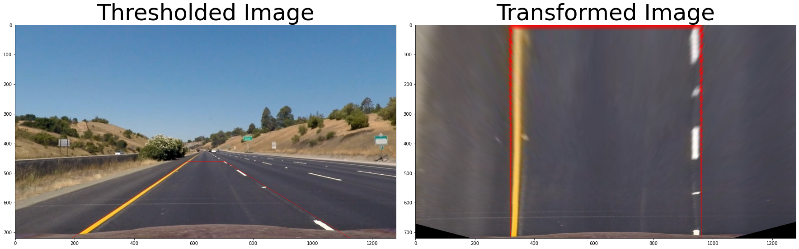

# **Finding Lane Lines on the Road** 

Project Goal
---

Implement an image pipeline that finds lane lines from road videos including:
* Takes road images from a video and return an annotated video stream
* Lane finding algorithm which:
  * finds the left and right lane lines and visualize the found lane
  * outputs visual display of the numerical estimation of lane curvature and vehicle position.


Reflection
---

### 1. Image Pipeline Description

The image pipeline is consists of the total of seven steps. I'll explain each step below.

1) Compute the camera calibration matrix and distortion coefficients given a set of chessboard images and apply a distortion correction to raw images.
2) Use color transforms, gradients, etc., to create a thresholded binary image.
3) Apply a perspective transform to rectify binary image ("birds-eye view").
4) Detect lane pixels and fit to find the lane boundary.
5) Determine the curvature of the lane and vehicle position with respect to center.
6) Warp the detected lane boundaries back onto the original image.
7) Output visual display of the lane boundaries and numerical estimation of lane curvature and vehicle position.

**1) Compute the camera calibration matrix and distortion coefficients given a set of chessboard images and apply a distortion correction to raw images**

First of all, it finds camera matrix from given chessboard images in `camera_cal` folder. The code for this step is in the first and second section in `01-distortion-correction.ipynb` file. Note that the size of the chessboard(`nx`,`ny`) must be considered before the computation. It find all chessboard corners with `cv2.findChessboardCorners()`. and finds calibration matrix and distortion coefficients with `cv2.calibrateCamera()` from found corners. Then, it applies undistortion to an image. It uses `cv2.undistort()` function for this step. I wraped this step with a function named `cal_undistort(img, mtx, dist)`, located at L26~28 of `image_functions.py`. An output example of this step is shown below.


*Fig 1. An example of undistorted road image*

**2) Use color transforms, gradients, etc., to create a thresholded binary image.**

After the undistortion step, it needs to seperate the lane from other objects in the image. The code for this step is in `02-color-gradient-thresholding.ipynb` and `thresholding.py`. First, I extracted test images from the input videos. Then, I aggregated the test images into a single image. Next, I created a simple OpenCV GUI app which can apply color and gradient thresholding into the test image to find out the best parameter to seperate lane lanes.
After this step, I wraped the thresholding process with a function named `threshold_combined()` which located at L34-56 of `image_functions.py`. The function seperates white and yellow color by generating masked images from image using rgb, hsv, hls image mask. In this step, it creates the three masked images. Then, it uses s channel for compute gradient and threshold the gradient image. The final image is combined the total of four images. An example output image is shown below.


*Fig 2. An example of thresholded road image*

**3) Apply a perspective transform to rectify binary image ("birds-eye view").**

After the thresholding step, it need to focus on lane area to seperating the lane line where the vehicle is currently located. In this step, the algorithm applies perspective transform to get bird eye view of the image.  I choosed the source and the destination to include in straight line image and transformed correctly.

| Source        | Destination   | 
|:-------------:|:-------------:| 
| 577, 460      | 320, 0        | 
| 190, 720      | 320, 720      |
| 1127, 720     | 960, 720      |
| 705, 460      | 960, 0        |

Then, it transformed image with `cv2.getPerspectiveTransform()` and `cv2.warpPerspective()` function. I created a wrapper function named `perspective_transform()` at L81-87 in `image_functions.py` file.


*Fig 3. An example of transformed road image*

**4) Detect lane pixels and fit to find the lane boundary.**

In this step, the algorithm detects the lane pixel and find the lane boundary. I implemented the sliding window technique to find lane pixel and estimate lane parameters. I also implemented an lane parameter estimating method that finds parameters from nearby pixels of the previous lane parameters. I used RANSAC algorithm instead of polynomial fitting for more robust results.


However, applying those methods naively doesn't work for some cases, since an image of road scene can be classified into multiple cases.

* Case 1: The lane pixel can be found but it doesn't have any prior knowledge (The first frame of the video)
* Case 2: The lane pixel can be found and it matches to the previous frames. 
* Case 3: The lane pixel can be found but it doesn't corresponds to the previous frames.
* Case 4: The lane pixel can not be found.

**5) Determine the curvature of the lane and vehicle position with respect to center.**


**6) Warp the detected lane boundaries back onto the original image.**


**7) Output visual display of the lane boundaries and numerical estimation of lane curvature and vehicle position.**

RANSAC polynomial fitting

This function inputs an edge image from canny edge detection and results the left and right lane lines from input image. I assumed that a curved line can be expressed with 2nd-order polynomial, which can also be expressed to a x^2 + bx + c =0. Therefore, I used RANSAC algorithm with 2nd-order to estimate the coefficients of the polynomial. I also added polynomial regression as safety measures for RANSAC algorithm. This process is applied to the left and right line edge to find both road boundaries.

```python
from sklearn.linear_model import RANSACRegressor
from sklearn.metrics import mean_squared_error
from sklearn.preprocessing import PolynomialFeatures
from sklearn.pipeline import make_pipeline

def get_polylines(img, direction='left'):
    # get nonzero value from image
    np_nz = np.transpose(np.nonzero(img))
    
    xdata = np_nz[:,1]
    ydata = np_nz[:,0]
    
    # RANSAC estimator
    try:
        estimator = RANSACRegressor()
        model = make_pipeline(PolynomialFeatures(2), estimator)

        model.fit(xdata.reshape(-1,1), ydata)
        # Predict data of estimated models
        draw_x = np.arange(xdata.min(), xdata.max())
        draw_y = model.predict(draw_x.reshape(-1,1))
    except:
        f = np.poly1d(np.polyfit(xdata,ydata,2))
        draw_x = np.arange(xdata.min(), xdata.max())
        draw_y = f(draw_x)
    
    draw_points = np.asarray([draw_x, draw_y], dtype=np.int32).T
    return draw_points
```

Results

The algorithm can find solid curved line from the test video. However, it showed unstable behavior when it shows when line edge are weak, which are when line is in shadow and if the space between dashed line is too long.

### 2. Identify potential shortcomings with your current pipeline

The algorithm could not detect lane lines correctly on following road conditions:
* Lane line splits and merge: entry ramps and exit ramps on highway
* Highly curved lane line: interchanges on highway, roundabouts, mountain roads
* Limited environmental conditions: heavy rain, low constrast lanes

### 3. Suggest possible improvements to your pipeline

The limitations can be improved if:
* the algorithm can classify situations for line splits and merge with the angle between the found left and right lanes. or the number of existing lines at each line segments.
* the parameter for line finding algorithm(i.e. RANSAC) is properly tuned, and ensemble of two or more line finding algorithms.
* template matching could improve the performance of the line detection at limited environmental conditions. 

References
---
[^1]: "In image processing applications, why do we convert from RGB to Grayscale?", Quora, https://www.quora.com/In-image-processing-applications-why-do-we-convert-from-RGB-to-Grayscale.

[image1]: ./resources/CarND-P1-Fig1.png "Image Pipeline"